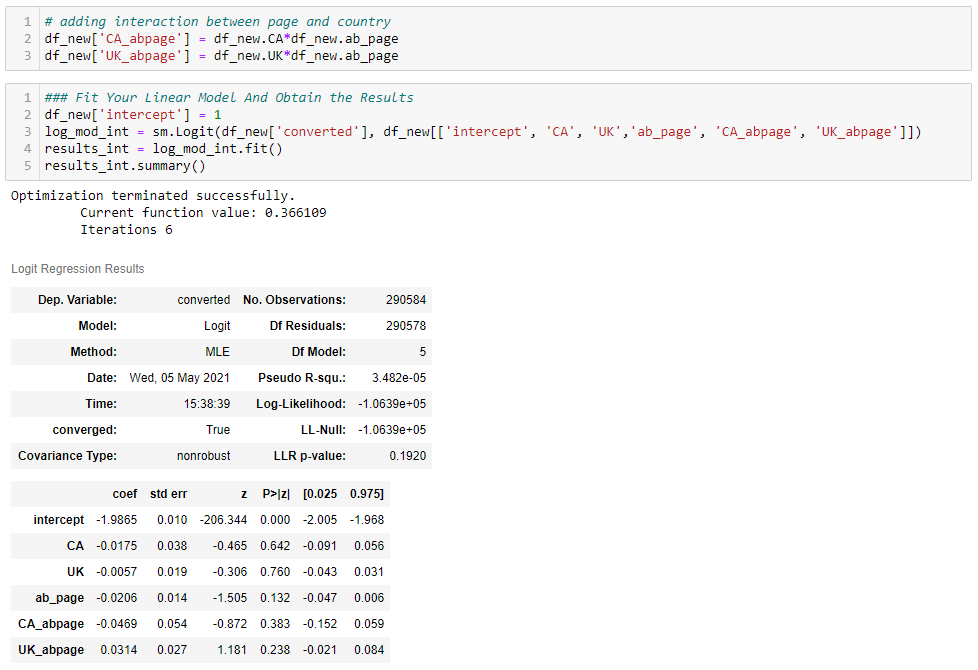

# A/B Testing

## Project Overview
A/B tests are very commonly performed by data analysts and data scientists. Well-established products typically have a large consumer base and reliable sales and usage metrics, and are highly valued by their company. As a result, it's too risky to implement changes directly to the product without proper evaluation of the consequences.

To properly evaluate potential product changes, companies can use a technique called A/B testing. A/B testing is a randomized controlled experiment that uses a control (unchanged) and experimental (changed) group to test potential changes using a success metric. A/B testing is used to test whether or not the distribution of the success metric increases in the experiment group instead of the control group; we would not want to make changes to the product that would cause a decrease in the success metric.

It is important to fully understand the concepts of A/B testing since they are widely used in the industry. This project focuses on best practices of A/B testing step by step.

For this project, I am analyzing an A/B test run by an e-commerce website. The goal is to help the company understand if they should implement the new page, keep the old page, or perhaps run the experiment longer to make their decision.

## Techniques and models used

- [x] Pandas `query` function
- [x] Probability and Bayes Rule
- [x] Establish a Research Question
- [x] Establish Null and Alternative Hypothesis
- [x] Simulate under null for 10,000 samples using Law of Large Numbers and binomial distribution method `np.random.binomial` & `np.random.normal`
- [x] Establish confidence interval
- [x] Calculating mean from null hypothesis and actual (observed) mean
- [x] Using z-test and p-value model form `statsmodels.api` to interpret results
- [x] Calculating critical value
- [x] Using logistic regression model to predict binary outcomes
- [x] Using Higher order terms and interactions

## Result and Charts from Analysis 

***For comprehensive analysis, please see the [jupiter notebook report](Analyze_AB_test.ipynb) where one can follow complete steps of A/B testing, accompanied with charts and explanation.***
 
### Distribution of differences and diference between acctual mean and mean under null

From the chart below we can see a simulated distribution of 10,000 samples from the null using `np.random.binomial` formula (blue bars). Red lines represent 95% confidence interval, dashed gray line represent the null mean and dashed dark blue line represent the actual mean.

 

<i>Figure 1: Distribution of differences for 10,000 samples</i>

Now we need to calculate p-value in order to reject or fail to reject the null hypothesis ($H_1: p_{new} - p_{old} > 0$) - that this calculating the area on the right side of the equation. Firstly, we calculate null_values by simulating the distribution under the null hypothesis and then finding the probability that our statistics came from this distribution. To simulate from the null we created a normal distribution centered at zero with the same standard deviation as sampling distribution and size. Next, we computed the p-value by finding the proportion of values in the null distribution that were greater than our observed difference: `null_value = np.random.normal(0, p_diffs.std(), p_diffs.size)` & `p_value = (null_value > pdiff_actual).mean()`

***For this analysis we got a p-value of 0.9009 meaning that nearly all statistics came from a null (almost all ~ 90%); therefore, we fail to reject null hypothesis, and conclude that alternative hypothesis is not true -> new page is the same or worse than the old page.***

### z-score and p-value with statsmodels.api

From the chart below we can see a simulated distribution of 10,000 samples from the null using `np.random.binomial` formula (light blue bars) standard deviation lines, area of z-score and area of critical value. This is another way to interpret values computed with the built-in function `statsmodels.api`.

 

<i>Figure 2: Distribution of simulation for 10,000 samples binned in 50 bins, standard deviations, z-score and critical value area</i>

***z-score of -1.31 falls between -1st and -2nd standard deviation - shaded gray area 
critical value of $\alpha$ = 0.05 (95% confidence interval) - shaded red area***

**Interpretation of p-value and z-value** 
The **z-value** is a test that measures the difference between an observed statistic and its hypothesized population parameter in units of standard error. We can compare the z-value to critical values of the standard normal distribution to determine whether to reject the null hypothesis. z-score shows how many standard deviations away our observed (actual) difference is to the center. How many standard deviations away pdiff_actual is from p_diffs. In order to interpret z-score we look at the critical value. Critical value for the 95% confidence interval (or alpha level of 0.05 or 5%) is 1.64. Our z-test is -3.11; therefore z-score value falls out of this critical value and we fail to reject the null hypothesis.  
The **p-value** is a probability that measures the evidence against the null hypothesis. A smaller p-value provides stronger evidence against the null hypothesis.

### Logistic regression and higher order terms

Sometimes we would like to fit models where the response is not lineary related to the explanatory variable. We can do this with what are known as higher order terms. Higher order terms include quadratics, cubics and many other relationships. In order to add these terms to our linear models, we can simply multiply our columns by one another. 

 

<i>Figure 3: Adding Higher Order Terms</i>

Adding higher terms did not improve the model. Based on p-value for CA_abpage and UK_abpage is 0.383 and 0.238, respectively indicating that interactions are not significant and we would consider removing them from the model. 
However it is essential to be aware of interactions since they can improve our models or even hurt if we do not add them and show significance. 

## Conclusions

p-value of 0.9009 means that nearly all statistics came from a null (almost all ~ 90%); therefore, we fail to reject null hypothesis and the company should stick with the old page. Z-score indicates similar: Critical value for the 95% confidence interval (or alpha level of 0.05 or 5%) is 1.64. Our z-test is -3.11; therefore z-score value falls out of this critical value and we fail to reject the null hypothesis. Adding additional features did not improve our model, since none of the features indicated significance. However it is essential to check for higher order interactions in order not to miss anything. The bottom line is we fail to reject null hypotheses and the company should stick with the old page.
