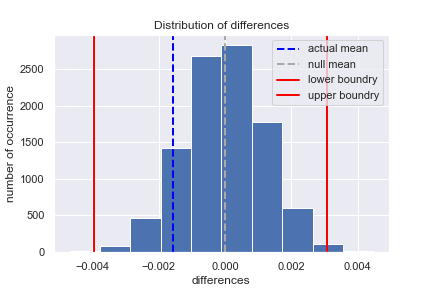

# AB Testing

## Project Overview
A/B tests are very commonly performed by data analysts and data scientists. Well-established products typically have a large consumer base and reliable sales and usage metrics, and are highly valued by their company. As a result, it's too risky to implement changes directly to the product without proper evaluation of the consequences.

To properly evaluate potential product changes, companies can use a technique called A/B testing. A/B testing is a randomized controlled experiment that uses a control (unchanged) and experimental (changed) group to test potential changes using a success metric. A/B testing is used to test whether or not the distribution of the success metric increases in the experiment group instead of the control group; we would not want to make changes to the product that would cause a decrease in the success metric.

It is important to fully understand the concepts of A/B testing since they are widely used in the industry. This project focuses on best practices of A/B testing step by step.

For this project, I am analyzing an A/B test run by an e-commerce website. The goal is to help the company understand if they should implement the new page, keep the old page, or perhaps run the experiment longer to make their decision.

## Techniques and models used

- [x] Pandas `query` function
- [x] Probability and Bayes Rule
- [x] State Research question
- [x] State Null and Alternative Hypothesis
- [x] Simulate under null for 10,000 samples using Law of Large Numbers and binomial distribution method `np.random.binomial` & `np.random.normal`
- [x] Stating confidence interval
- [x] Calculating mean from null hypothesis and actual (observed) mean
- [x] Using z-test and p-value model form `statsmodels.api` to interpret results
- [x] Calculating critical value
- [x] Using logistic regression model to predict binary outcomes
- [x] Using Higher order terms and interactions

## Result and Charts from Analysis 
 Comprehensive analysis for AB Testing can be found in [ipynb file](Analyze_AB_test.ipynb)

From the chart below we can see a simulated distribution of 10,000 samples from the null using `np.random.binomial` formula (blue bars). Red lines represent 95% confidence interval, dashed gray line represent the null mean and dashed dark blue line represent the actual mean.

 

<i>Figure 1: Distribution of differences for 10,000 samples</i>

Now we need to calculate p-value in order to reject or fail to reject the null hypothesis ($H_1: p_{new} - p_{old} > 0$) - that this calculating the area on the right side of the equation:Firstly, we calculate null_values by simulating the distribution under the null hypothesis and then finding the probability that our statistics came from this distribution. To simulate from the null we created a normal distribution centered at zero with the same standard deviation as sampling distribution and size. Next, we computed the p-value by finding the proportion of values in the null distribution that were greater than our observed difference: `null_value = np.random.normal(0, p_diffs.std(), p_diffs.size)` & `p_value = (null_value > pdiff_actual).mean()`

***For this analysis we got a p-value of 0.9009 meaning that nearly all statistics came from a null (almost all ~ 90%); therefore, we fail to reject null hypothesis, and conclude that alternative hypothesis is not true -> new page is the same or worse than the old page.***

 

<i>Figure 2: Distribution of simulation for 10,000 samples binned in 50 bins, standard deviations, z-score and critical value area.</i>

